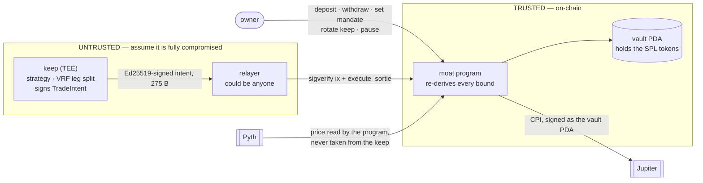

<h1 align="center">Moat</h1>

<p align="center">
  
</p>

<p align="center">
  <a href="https://moat-vault.vercel.app"><strong>🌐 Live app</strong></a> &nbsp;·&nbsp;
  <a href="https://explorer.solana.com/address/FResswSN9ZiV6mCfhWJHowDY354km4cEgBXTYb1Ro7MQ?cluster=devnet">📡 Program on devnet</a> &nbsp;·&nbsp;
  <a href="#verify-it-yourself">🔍 Verify it yourself</a>
</p>

<p align="center">
  
  
  
  
</p>

---

**A non-custodial Solana vault where the strategy stays secret, the limits live on-chain, and
the vault survives its own trading engine being completely compromised.**

**Live app: [moat-vault.vercel.app](https://moat-vault.vercel.app)** · Solana devnet ·
program `FResswSN9ZiV6mCfhWJHowDY354km4cEgBXTYb1Ro7MQ` ·
vault `BwBpUVTbzQCw5Xo7E6LHZTchJTPXcVZTw3KBAGBnXzQx`

A TEE — *the keep* — holds the strategy and signs trade intents. It never holds the keys and it
cannot move a lamport. Before any fill settles, the Anchor program reads Pyth **itself**, computes
what an honest fill is worth, and refuses anything below `expected × (1 − max_slippage)`. So a
compromised keep never gets to name the price it settles at; its residual authority collapses to
*trade badly, inside limits you set* — a P&L problem, not a custody one. The owner can always
withdraw, including while the vault is paused, with the enclave uninvolved.

Every refusal claimed below is reproducible against the deployed program from your own machine,
and the live app runs six of them on page load — see [Verify it yourself](#verify-it-yourself).

---

## What it is

Run a proprietary strategy for other people's money and you pick one of two bad options:

- **Custody it.** Client funds sit in an operator wallet. You carry the trust burden, the
  regulatory surface and the headline risk.
- **Reveal it.** You publish the strategy on-chain so it can be verified. Anyone can copy your
  edge, and it decays.

The usual escape hatch is *"trust our TEE"*, which moves the trust rather than removing it. Moat
assumes the enclave is already compromised and asks what still holds.

> Before settling, the program reads Pyth itself, computes what an honest fill is worth, and
> **refuses anything below `expected × (1 − max_slippage)`.**

**Why that specific check is the whole design.** Spending caps sound like they bound the damage,
but they bound the *size* of a trade, not the *price*. A compromised keep that stays politely
under your $5,000 per-trade cap can still route the entire trade into a pool it controls and
settle at any price it likes. Every cap passes. Every allowlist passes. The money leaves anyway.

Caps are a size bound. The oracle floor is a price bound. Almost every TEE-plus-DeFi design ships
the first and not the second.

A verification property falls out of the same mechanism for free: every fill publishes three
numbers — the oracle-fair output, the floor demanded, and the amount actually received. That is
enough for a depositor to audit execution quality to the basis point, and nowhere near enough to
reconstruct why any trade happened.

## What it does

| Capability | Status |
|---|---|
| Non-custodial vault PDA holding SPL tokens | **Live on devnet** |
| Owner-set mandate — caps, mint/venue allowlists, slippage, cooldown, oracle bounds | **Live**, vault runs policy `v1` |
| Oracle-derived price floor, re-derived on-chain for every fill | **Implemented**, enforced in `execute_sortie` |
| Ed25519 enclave-signature verification by instruction introspection | **Implemented** |
| Deposit · withdraw · pause · set mandate · rotate keep | **Live**, sendable from the app with a wallet |
| Owner withdrawal that works while paused and never touches the enclave | **Live** |
| VRF leg-splitting, so the vault does not trade to a readable rhythm | Implemented in `moat-core`; **not verified on-chain** |
| Jupiter CPI settlement | Compiles and is wired; **never executed on devnet** |
| On-chain TEE attestation (TDX quote) verification | **Not implemented** — the owner verifies the quote off-chain |
| Web app: live desk, floor chart, instruction console, on-chain prover | **Live** |

## How it does it

### The trust boundary



The trust boundary is the arrow labelled *signed intent*. Everything to its left can be owned by
an attacker without the vault losing custody.

### One trade, end to end

1. The keep evaluates the private strategy against oracle prices. Decision: buy $4,000 of SOL.
2. `sortie::plan` splits it into unequal legs at unequal times, seeded by a VRF, so the vault does
   not trade to a readable rhythm.
3. Each leg becomes a `TradeIntent` — fixed-width, domain-separated — signed with the enclave key.
4. A relayer (untrusted, could be anyone) submits one: an Ed25519 instruction plus `execute_sortie`.
5. The program verifies the signature by **instruction introspection**, then re-derives *every*
   bound: nonce, policy version, expiry, caps, allowlists, oracle staleness and confidence, and the
   price floor.
6. It CPIs into Jupiter, signing as the vault PDA.
7. Post-conditions: received ≥ `min_amount_out`, spent **exactly** `amount_in`, and no other
   vault-owned token account was touched.
8. `SortieExecuted` publishes the three numbers the dashboard verifies.

### What survives a fully compromised keep

| Attack | What stops it |
|---|---|
| Move more than the per-trade cap | `max_trade_notional`, priced in USD from the chain's own oracle read |
| Grind the vault down over a day | `max_daily_notional` — see [What is not done](#being-straight-about-what-is-not-done) |
| Trade an asset you never approved | Mint allowlist, each mint bound to a specific Pyth feed id |
| Route through an unapproved program | Venue allowlist |
| Replay, reorder or skip a leg | Strictly sequential nonce |
| Outrun a limit you just tightened | `set_policy` bumps `policy_version`, stranding every already-signed intent |
| Substitute the accounts being measured | `vault_in`/`vault_out` pinned by ATA derivation; any other vault-owned token account in the route is rejected |
| **Settle at a price of its choosing** | **The oracle-derived floor** |

And the property that makes it non-custodial: **the owner can always withdraw, including while
paused.** No cap, no cooldown, no enclave involvement.

---

## Verify it yourself

Nothing in this section requires a wallet, funds, or trusting this repository.

### The deployed artefacts

| What | Address | Check it |
|---|---|---|
| Program | `FResswSN9ZiV6mCfhWJHowDY354km4cEgBXTYb1Ro7MQ` | [Explorer](https://explorer.solana.com/address/FResswSN9ZiV6mCfhWJHowDY354km4cEgBXTYb1Ro7MQ?cluster=devnet) — executable, BPF loader |
| Vault PDA | `BwBpUVTbzQCw5Xo7E6LHZTchJTPXcVZTw3KBAGBnXzQx` | [Explorer](https://explorer.solana.com/address/BwBpUVTbzQCw5Xo7E6LHZTchJTPXcVZTw3KBAGBnXzQx?cluster=devnet) — data length is exactly `Vault::LEN` |
| Owner / guardian | `6frTwSLinb9R3kUFcxuJnkn8VHruRgrqwK4krz3qea1` | bytes 9–41 and 41–73 of the vault account |
| Registered keep | *none* — `enclave_key` is 32 zero bytes | bytes 73–105. The vault holds funds and **cannot trade** |

```bash
# The vault account is exactly Vault::LEN bytes — the same number the frontend's
# hand-written byte offsets sum to, and the same number state.rs computes.
curl -s https://api.devnet.solana.com -X POST -H 'content-type: application/json' \
  -d '{"jsonrpc":"2.0","id":1,"method":"getAccountInfo","params":
      ["BwBpUVTbzQCw5Xo7E6LHZTchJTPXcVZTw3KBAGBnXzQx",{"encoding":"base64"}]}' \
  | python -c "import sys,json,base64; \
      print('bytes:', len(base64.b64decode(json.load(sys.stdin)['result']['value']['data'][0])))"
# → bytes: 878
```

### Six refusals, decided by the chain

The app builds six real instructions, addressed to the deployed program and the live vault, and
runs them through `simulateTransaction`. Nothing is signed and nothing settles. The verdicts below
are the cluster's, not ours — error numbers, messages and source locations all come back in the
program logs.

| # | Asked of the program | Signed as | Verdict | Program's answer |
|---|---|---|---|---|
| 1 | `set_policy` with `max_slippage_bps = 10000` | the **owner** | `REFUSED` | `InvalidPolicy` **#6039** — thrown at `programs/moat/src/state.rs:190` |
| 2 | `set_policy` with `max_slippage_bps = 50` | the **owner** | `ACCEPTED` | ran to completion |
| 3 | `set_paused(true)` | a stranger | `REFUSED` | `NotGuardian` **#6041** — `programs/moat/src/drawbridge.rs:131` |
| 4 | `set_paused(true)` | the **owner** | `ACCEPTED` | ran to completion |
| 5 | `set_paused(false)` | a stranger | `REFUSED` | `NotOwner` **#6040** — `programs/moat/src/drawbridge.rs:133` |
| 6 | `rotate_signet` (register your own keep) | a stranger | `REFUSED` | `NotOwner` **#6040** — account constraint on `owner` |

**Row 1 is the one that matters.** `max_slippage_bps = 10000` means the tolerated fraction is the
entire trade: the floor collapses to zero and the one bound that constrains *price* rather than
*size* silently stops existing. The owner is the most privileged key in the system and the program
still refuses. That refusal is a `require!` in `state.rs`, not a UI affordance.

**Rows 2 and 4 are not filler.** A panel where every row is red demonstrates a broken test harness
just as well as a working vault. Rows 1 and 2 differ by one field; rows 3 and 4 differ only by who
signed. The acceptances are what make the refusals mean something.

Open [the app](https://moat-vault.vercel.app/#/app) and the table runs itself, with the raw
`err` object and full program logs behind each row. The probe definitions are
[`app/spyglass/src/data/prove.ts`](app/spyglass/src/data/prove.ts) — they use the same instruction
encoder and the same account lists the Console uses to send real transactions.

---

## Try it

The fastest path is the live app: **[moat-vault.vercel.app](https://moat-vault.vercel.app)**.
No wallet needed to read anything.

- **[Desk](https://moat-vault.vercel.app/#/app)** — the price and the floor beneath it, sampled
  live from the same Pyth account `execute_sortie` reads. Size a trade and watch the deployed
  vault's real caps decide, with the first failing check named. Then the six refusals above.
- **[Console](https://moat-vault.vercel.app/#/console)** — build any instruction against any
  vault. Every action encodes real Anchor data and renders it field by field before anything is
  signed. Connect a wallet and it will actually send.
- **[Attack](https://moat-vault.vercel.app/#/attack)** — you hold the compromised enclave. Try to
  drain the vault. Switch the oracle floor off to see what the caps are worth on their own.
- **Vault** and **Mandate** — execution quality per fill, and a policy editor that replays history
  through the rules the way the chain would.

Because devnet's Pyth feeds are pushed on a slow cadence, the desk regularly shows
*"the vault refuses — oracle stale"*. That is the staleness gate working, not a bug; the chart
draws those windows in coral.

## Run and check locally

```bash
# The security kernel — no Solana toolchain, no network, no validator.
cd crates/moat-core && cargo test

# The enclave half.
cd keep && cargo test

# The program.
cargo test -p moat --lib

# The real target. Run this before trusting any change to an Accounts struct:
# the host check cannot see the 4 KB BPF stack frame.
export PATH="$HOME/.local/share/solana/install/active_release/bin:$PATH"
cargo-build-sbf --manifest-path programs/moat/Cargo.toml

# The web app. It needs no environment variables — src/data/config.ts falls back
# to the real devnet program and vault.
cd app/spyglass && npm install && npm run dev
```

The SBF build is not a formality. It caught a defect the host check cannot see:
`ExecuteSortie::try_accounts` overflowed the 4 KB BPF stack frame by roughly 384 bytes, because
`Vault` is 878 bytes and was being deserialised inline alongside two Pyth updates and two token
accounts. That is undefined behaviour at runtime, not a warning.

## Repository layout

```
crates/moat-core/       the security kernel — zero dependencies, its own Cargo workspace
  intent.rs               canonical fixed-width, domain-separated signed encoding
  policy.rs               check_intent(): every bound the chain re-derives
  sortie.rs               VRF → leg split and timing
programs/moat/          the Anchor program (Anchor 1.1.2)
  portcullis.rs           execute_sortie — the only path that moves funds
  signet.rs               Ed25519 verification by instruction introspection
  drawbridge.rs           deposit / withdraw / pause
  oracle.rs               Pyth read, bound to the mint's own feed id
  state.rs                the Vault account and policy validation
  errors.rs               one error code per denial, never collapsed into Unauthorized
keep/                   the TEE half: strategy eval, VRF planning, intent signing
app/spyglass/           the web app (React + Vite; @solana/web3.js is the only Solana dep)
  src/data/prove.ts       the six on-chain probes
  src/data/config.ts      deployment constants; env-optional by design
  src/views/Desk.tsx      the live desk
  src/components/FloorChart.tsx   price, floor, and the refusal zone
```

`moat-core` is deliberately dependency-free and lives in its own Cargo workspace, so the
security-critical arithmetic can be tested with a plain `cargo test` — no Solana toolchain, no
network, no validator. The same crate is compiled into both the program and the keep, so both
sides of the trust boundary run identical arithmetic by construction rather than by discipline.

---

## Being straight about what is not done

This is a devnet project. The list below is deliberately longer than the feature list.

**The keep is not attested on-chain.** `rotate_signet` records the measurement the owner approved
so it is publicly auditable, but the chain does not parse a TDX quote or walk a certificate chain.
The owner verifies the quote off-chain. On-chain verification is real work inside a compute
budget, not a line of code, and claiming otherwise would be the biggest lie this README could
tell. **Until that exists, "the enclave is running the code you think" rests on the owner's
off-chain check.**

**The live vault has never traded, and currently cannot.** Its `enclave_key` is 32 zero bytes, so
no keep is registered and `execute_sortie` would refuse every intent. `next_nonce` is 0. The
Jupiter CPI and the on-chain Pyth read compile and are wired, but **no sortie has ever executed on
devnet.** Everything proven in [Verify it yourself](#verify-it-yourself) is an authority or policy
check, not a settled trade.

**Some dashboard fills are illustrative.** The vault, its mandate and its state are read live. The
per-fill execution-quality history is sample data, because the vault has no history — the app says
so in its own footer, and the Console reads the same account directly so you can check.

**On-chain VRF verification is missing.** `vrf_commitment` is carried and published, but the chain
does not check that the leg split matches a real VRF output, so unpredictability currently rests
on the keep's honesty.

### Known issues, found by auditing this code and still open

- **The daily cap window is tumbling, not rolling.** `day_index = slot / SLOTS_PER_DAY` resets at
  fixed boundaries, so the full cap is spendable just before one and again just after — an
  effective 2× across a 24-hour period that straddles a boundary. Size the cap accordingly, or
  implement the rolling window.
- **`MintRule.decimals` is owner-declared and never checked against the SPL mint.** Every notional
  and every slippage floor derives from it, so a 6-versus-9 typo moves every bound by 1000×. The
  fix is to require the `Mint` account in `set_policy` and compare.
- **`expected_out` truncates toward zero**, so for an output mint coarse enough that the honest
  output rounds to zero, the floor is vacuous. Not reachable for SOL/USDC.

### One critical bug, found and fixed

`vault_in` and `vault_out` were pinned only by `token::authority`, and creating a token account
owned by the vault PDA is permissionless. A relayer could therefore hand the program two empty
accounts to *measure* while the route drained the real one: every post-condition passed against a
delta of zero. They are now pinned by ATA derivation, with `spent == amount_in` enforced exactly
and a scan that rejects any other vault-owned token account in the route.

A second one, in the frontend: Vite does not polyfill `Buffer`, and `@solana/web3.js` needs it.
Every transaction-building path threw `Buffer is not defined` — but only at *send* time, so reads
and the instruction encoder looked healthy while signing was dead. Polyfilled at the entrypoint.

## License

MIT
